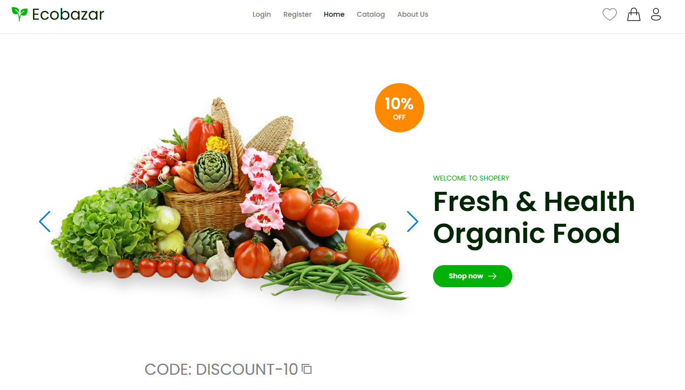
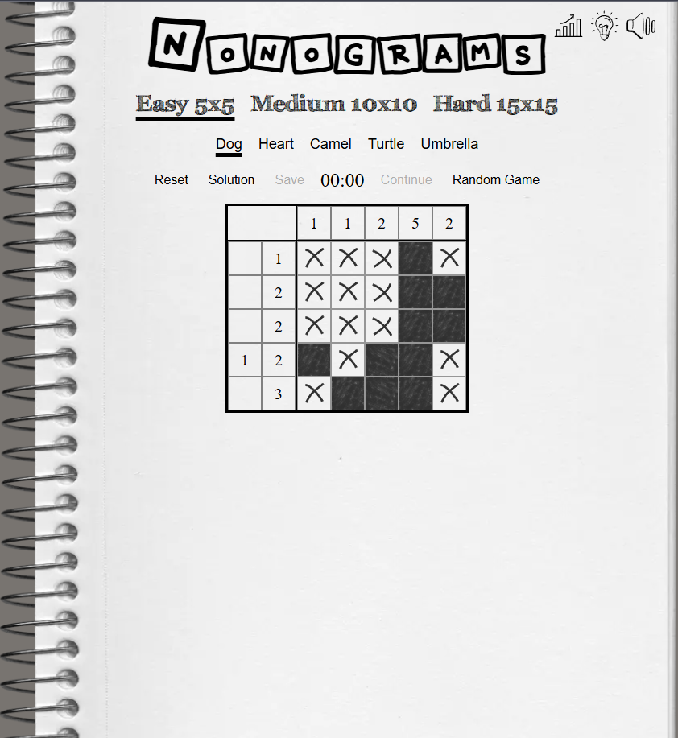

  

<h1 align="center">Hi there, I'm Alexey Kandyba </h1>
<h2 align="center">Frontend developer</h2>

  
  

<h2 align="center">🙍‍♂️ About:</h2>

👨‍🔬 2+ years of development experience

🤝 Team player and team leader

📚 Currently learning Node JS

🌎 Russian **native**, English **B1**

<h2 align="center">🛠️ Tech Stack & Tools</h2>

  
  
  
  
  
  

  
  
  
  
  
  
  

  
  
  
  
  
  
  
  
  
  
  
  
  
  
  
  

  
  
  

  
  

<h2 align="center">📊 My Stats:</h2>

  
  

<h3 align="center">🏆 GitHub Trophies:</h3>

<h2 align="center">📂 Projects:</h2>

<table>
  <tr>
    <td></td>
    <td>
      <h3 align="center">eLogist App</h3>
      
<b>Service that is provided to customers (logistics operators of various types) in the form of an API service with a customizable application</b>

      
On the website of the eLogistapp company, customers can register and pay for the service according to the batch model for the number of processed requests. An additional service is the integration and adaptation of the mobile application and API service in accordance with the configuration of the client company.

      
<b>Role:</b> Frontend developer.

      
<b>Stack:</b> React, TypeScript, ReduxToolkit + RTK Query, CSS Modules, React Hook Form, Zod, ESLint, Prettier, SonarQube

      
<b>Contribution:</b>

      <ul>
        <li>Refactored ~30% of the codebase, eliminating duplication and simplifying the module structure, which accelerated project navigation and facilitated further development.</li>
        <li>Updated authentication flow: redesigned login and registration pages for better UX.</li>
        <li>Migrated data layer from Axios to RTK Query, enabling built-in caching and auto-refetching across 15+ API endpoints</li>
        <li>Developed a custom data parser to handle conversion between snake_case (server-side) and camelCase (client-side) naming conventions.</li>
        <li>Implemented a password verification page and key profile screens, providing the basis for further security features.</li>
      </ul>
      
Deploy: Planned — contributing to the pre-release refactoring phase before the initial MVP deployment (NDA).

      
Repository: private (NDA).

    </td>
  </tr>

  <tr>
    <td></td>
    <td>
      <h3 align="center">REST Client</h3>
      
<b>Web-based REST API testing tool (analogous to Postman), allowing users to send HTTP requests, organize history, and manage environment variables</b>

      
The application enables users to authenticate, construct API requests, inspect responses, and store previous queries for reuse. Authenticated and guest users have access to different interface states, ensuring a secure and structured workflow.

      
<b>Role:</b> Frontend Developer

      
<b>Stack:</b> Next.js, TypeScript, Next Intl (i18n), shadcn/ui, Tailwind, Firebase Auth, Firebase Cloud DB, SWR, React Hook Form, Zod, Biome, Lefthook, Vitest + React Testing Library

      
<b>Contribution:</b>

      <ul>
        <li>Implemented authentication flow via Next.js API routes with Firebase token validation and persistent user sessions.</li>
        <li>Restricted access to private sections (REST Client, History, Variables) using route guards with automatic redirects for unauthorized users.</li>
        <li>Built reactive UI states that adapt layout, navigation, and available actions depending on whether the user is authenticated or not.</li>
        <li>Integrated internationalization (i18n) using Next Intl with localization-ready structure.</li>
        <li>Configured Vitest testing environment and implemented unit tests.</li>
      </ul>
      
<b>Deploy:</b> <a href="https://rest-client-wingedseraph.netlify.app/ru" target="_blank" rel="noreferrer">link</a>

      
<b>Repository:</b> <a href="https://github.com/wingedseraph/rest-client-app">link</a>

    </td>
  </tr>

  <tr>
    <td></td>
    <td>
      <h3 align="center">Ecobazar</h3>
      
<b>Online shop integrated with CommerceTools API</b>

      
E-commerce SPA, based on CommerceTools SDK. Adaptive to 390px semantic layout, browser routing, autorization/registration/profile pages, catalog, cart, supporting promocodes and dynamic price calculation for different countries — all, that you need for e-shopping. Has unit tests coverage.

      
<b>Role:</b> Team Lead

       
<b>Stack:</b> React, TypeScript, Vite, CommerceTools SDK, React Router, React Hook Form, Sonner, Swiper, Vitest + React Testing Library, ESLint, Prettier, Stylelint, Husky, Commitlint, Lint-Staged

      
<b>Contribution:</b>

      <ul>
        <li>Integrated automated CI/CD pipeline using GitHub Actions with Lighthouse performance checks to ensure consistent UX quality across deployments</li>
        <li>Developed authentication and user management, including Login, Registration, and Profile pages.</li>
        <li>Implemented route protection with React Router and tailored UI visibility based on authentication state.</li>
        <li>Set up pre-commit automation and code quality pipeline with Husky, Commitlint, and Lint-Staged.</li>
        <li>Configured Vitest testing environment and implemented unit tests.</li>
      </ul>
      
<b>Deploy:</b> <a href="https://ecobazar-sprint4.netlify.app/" target="_blank" rel="noreferrer">link</a> (commercetools data is unavailable - ends trial period).

      
<b>Repository:</b> <a href="https://github.com/RobMarv1n/eCommerce-Application">link</a>

    </td>
  </tr>

  <tr>
    <td></td>
    <td>
      <h3 align="center">Nonograms</h3>
      
<b>Online shop integrated with CommerceTools API</b>

      
E-commerce SPA, based on CommerceTools SDK. Adaptive to 390px semantic layout, browser routing, autorization/registration/profile pages, catalog, cart, supporting promocodes and dynamic price calculation for different countries — all, that you need for e-shopping. Has unit tests coverage.

      
<b>Role:</b> Team Lead

       
<b>Stack:</b> React, TypeScript, Vite, CommerceTools SDK, React Router, React Hook Form, Sonner, Swiper, Vitest + React Testing Library, ESLint, Prettier, Stylelint, Husky, Commitlint, Lint-Staged

      
<b>Contribution:</b>

      

        - Integrated automated CI/CD pipeline using GitHub Actions with Lighthouse performance checks to ensure consistent UX quality across deployments
        - Developed authentication and user management, including Login, Registration, and Profile pages.
        - Implemented route protection with React Router and tailored UI visibility based on authentication state.
        - Set up pre-commit automation and code quality pipeline with Husky, Commitlint, and Lint-Staged.
        - Configured Vitest testing environment and implemented unit tests.
      

      
<b>Deploy:</b> <a href="https://rolling-scopes-school.github.io/robmarv1n-JSFE2024Q4/nonograms/" target="_blank" rel="noreferrer">link</a>

      
<b>Repository:</b> <a href="#">private</a>

    </td>
  </tr>

</table>

<h2 align="center">🎓 Courses:</h2>

<h3>JavaScript:</h3>

<a href="https://app.rs.school/certificate/9s7trg01" target="_blank" rel="noreferrer">
<a href="https://app.rs.school/certificate/b4d05mfa" target="_blank" rel="noreferrer">

  <h3>💬 Let's Connect!</h3>
  
I'm always excited to discuss frontend development, share knowledge, and collaborate on interesting projects.

  

    
    
  

