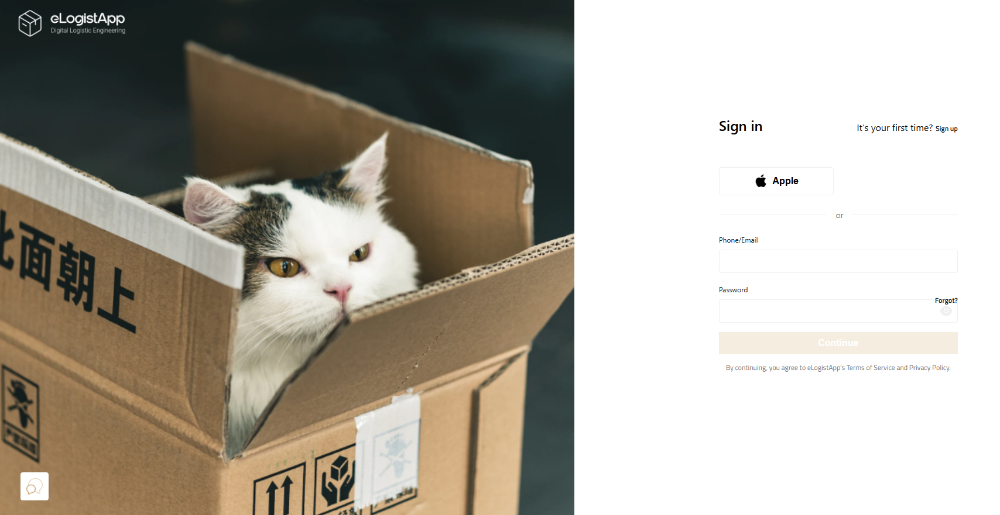
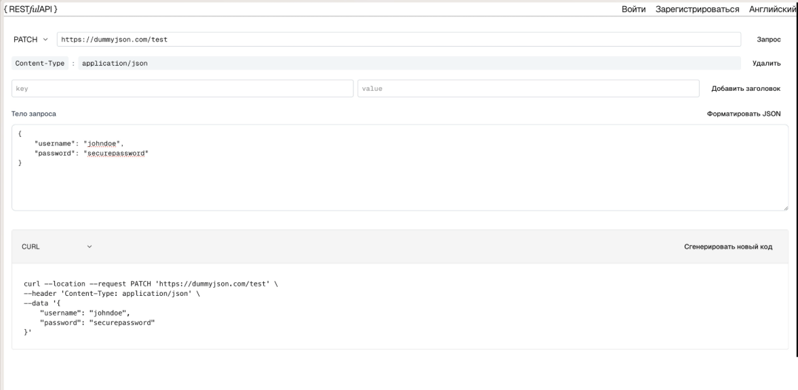
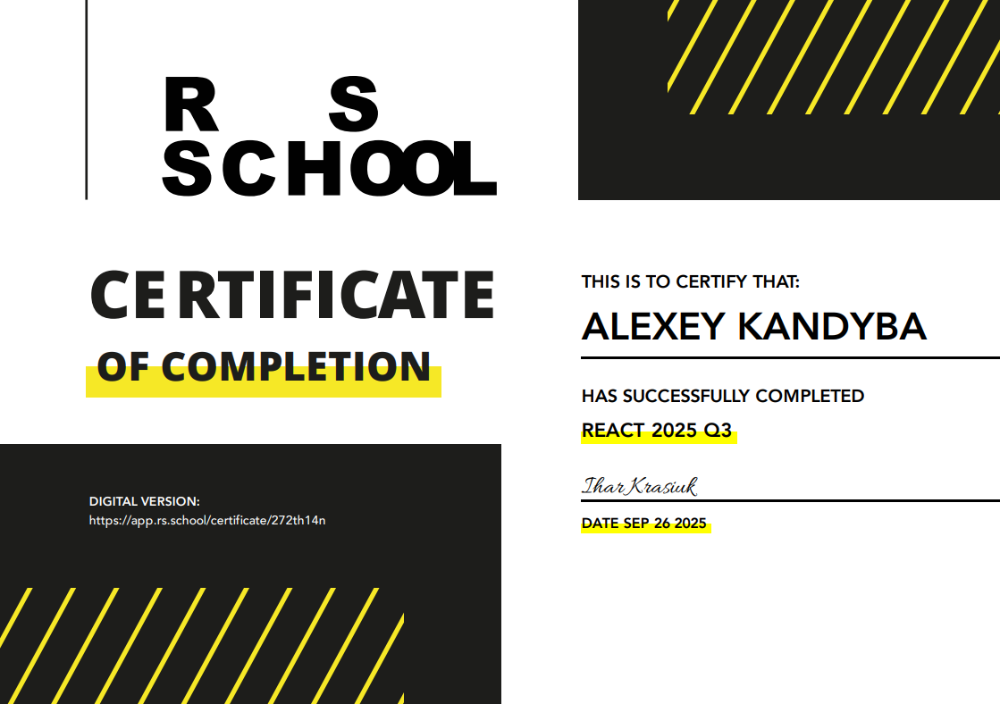
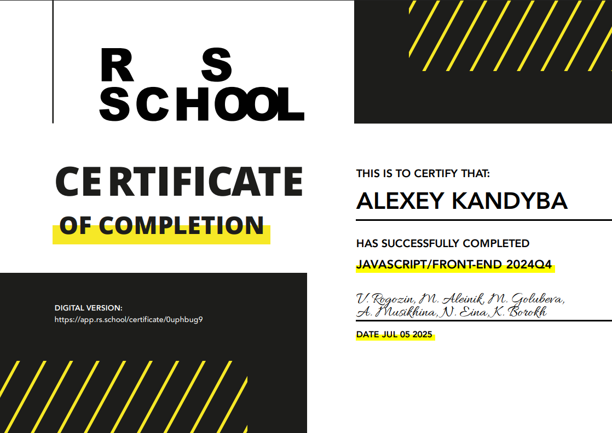

  

<h1 align="center">Hi there, I'm Alexey Kandyba </h1>
<h3 align="center">Frontend developer</h3>

  
  

<h3 align="center">About:</h3>

👨‍🔬 2+ years of development experience

🤝 Team player and team leader

📚 Currently learning Node JS

🌎 Russian, English **B1**

<h3 align="center">🛠️ Tech Stack & Tools</h3>

  
  
  
  
  
  

  
  
  
  
  
  
  

  
  
  
  
  
  
  
  
  
  
  
  
  

  
  
  

  
  

<h3 align="center">Stats:</h3>

<!--  -->

<h3 align="center">Projects:</h3>

<table>
  <tr>
    <td></td>
    <td>
      <h3 align="center">eLogist App</h3>
      
<b>Service that is provided to customers (logistics operators of various types) in the form of an API service with a customizable application</b>

      
On the website of the eLogistapp company, customers can register and pay for the service according to the batch model for the number of processed requests. An additional service is the integration and adaptation of the mobile application and API service in accordance with the configuration of the client company.

      
Role: Frontend developer.

      
Stack: React, TypeScript, ReduxToolkit + RTK Query, CSS Modules, React Hook Form, Zod, ESLint, Prettier

      
<b>Contribution:</b>

      <ul>
        <li>Refactored large portions of the codebase, improving maintainability and reducing redundant code by more than 30%.</li>
        <li>Updated authentication flow: redesigned login and registration pages for better UX.</li>
        <li>Replaced Axios with RTK Query for more efficient and structured data management.</li>
        <li>Developed a custom data parser to handle conversion between snake_case (server-side) and camelCase (client-side) naming conventions.</li>
        <li>Implemented password verification page and developed key sections of the user profile module.</li>
      </ul>
      
Deploy: Planned — contributing to the pre-release refactoring phase before the initial MVP deployment (NDA).

      
Repository: private (NDA).

    </td>
  </tr>

  <tr>
    <td></td>
    <td>
      <h3 align="center">REST Client</h3>
      
<b>Web-based REST API testing tool (analogous to Postman), allowing users to send HTTP requests, organize history, and manage environment variables</b>

      
The application enables users to authenticate, construct API requests, inspect responses, and store previous queries for reuse. Authenticated and guest users have access to different interface states, ensuring a secure and structured workflow.

      
<b>Role:</b> Frontend Developer

      
<b>Stack:</b> Next.js, TypeScript, Next Intl (i18n), shadcn/ui, Tailwind, Firebase Auth, Firebase Cloud DB, SWR, React Hook Form, Zod, Biome, Lefthook, Vitest + React Testing Library

      
<b>Contribution:</b>

      <ul>
        <li>Implemented authentication flow via Next.js API routes with Firebase token validation and persistent user sessions.</li>
        <li>Restricted access to private sections (REST Client, History, Variables) using route guards with automatic redirects for unauthorized users.</li>
        <li>Built reactive UI states that adapt layout, navigation, and available actions depending on whether the user is authenticated or not.</li>
        <li>Integrated internationalization (i18n) using Next Intl with localization-ready structure.</li>
        <li>Configured Vitest testing environment and implemented unit tests.</li>
      </ul>
      
<b>Deploy:</b> <a href="https://rest-client-wingedseraph.netlify.app/ru" target="_blank" rel="noreferrer">link</a>

      
<b>Repository:</b> <a href="https://github.com/wingedseraph/rest-client-app">link</a>

    </td>
  </tr>

  <tr>
    <td></td>
    <td>
      <h3 align="center">Ecobazar</h3>
      
<b>Online shop integrated with CommerceTools API</b>

      
The application enables users to authenticate, construct API requests, inspect responses, and store previous queries for reuse. Authenticated and guest users have access to different interface states, ensuring a secure and structured workflow.

      
<b>Role:</b> Frontend Developer

       
<b>Stack:</b> React, TypeScript, Vite, CommerceTools SDK, React Router, React Hook Form, Zod, Sonner, Swiper, spinners-react, Vitest + React Testing Library, ESLint, Prettier, Stylelint, Husky, Commitlint, Lint-Staged

      
<b>Contribution:</b>

      <ul>
        <li>Developed authentication and user management, including Login, Registration, and Profile pages.</li>
        <li>Implemented route protection with React Router and tailored UI visibility based on authentication state.</li>
        <li>Configured CommerceTools client and integrated product retrieval logic.</li>
        <li>Set up pre-commit automation and code quality pipeline with Husky, Commitlint, and Lint-Staged.</li>
        <li>Configured Vitest environment and wrote tests covering authentication and form validation logic.</li>
      </ul>
      
<b>Deploy:</b> <a href="https://ecobazar-sprint4.netlify.app/" target="_blank" rel="noreferrer">link</a>

      
<b>Repository:</b> <a href="https://github.com/RobMarv1n/eCommerce-Application">link</a>

    </td>
  </tr>

</table>

<h3 align="center">Courses:</h3>

<h4>JavaScript:</h4>

<a href="https://app.rs.school/certificate/9s7trg01" target="_blank" rel="noreferrer">
<a href="https://app.rs.school/certificate/b4d05mfa" target="_blank" rel="noreferrer">